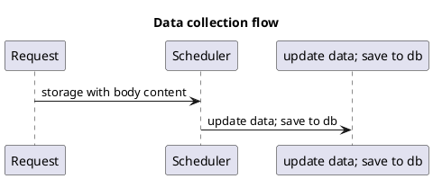
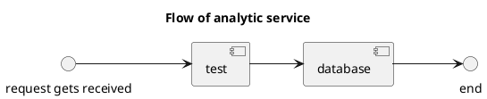

```plantuml
@startuml
title Data collection flow
participant "Request" as R
participant "Scheduler" as S
participant "update data; save to db" as U

R -> S: storage with body content
S -> U: update data; save to db
@enduml
```

## Request inside analytic service

```plantuml
@startuml
title Flow of analytic service
left to right direction

circle "request gets received" as a
component "test" as b
component "database" as c
circle "end" as d


a --> b
b --> c
c --> d
@enduml
```
